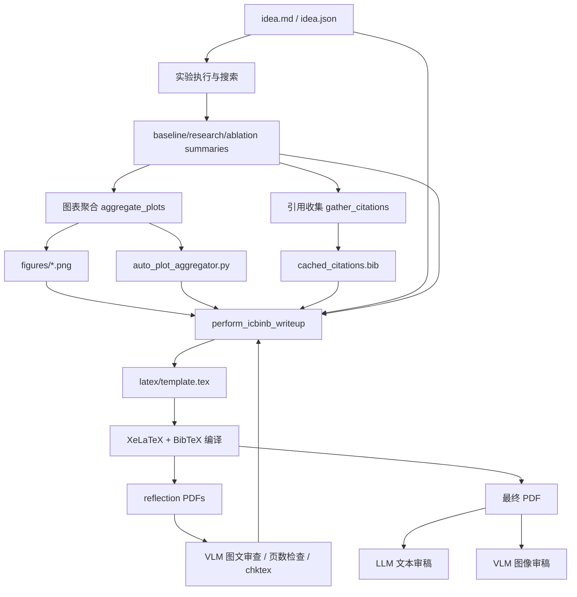
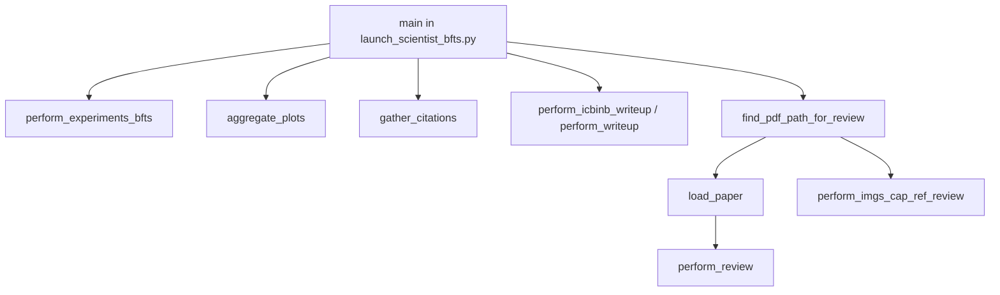
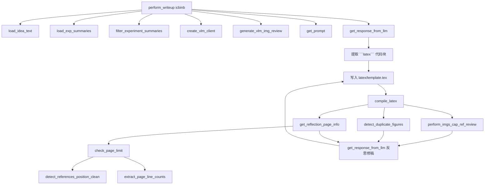
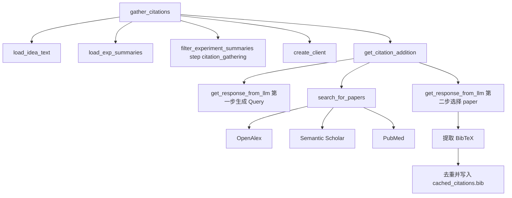
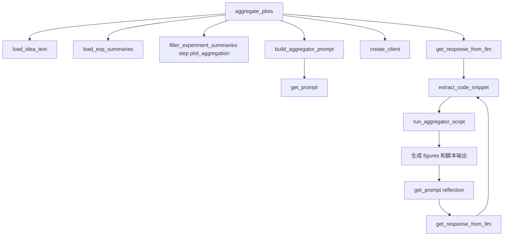
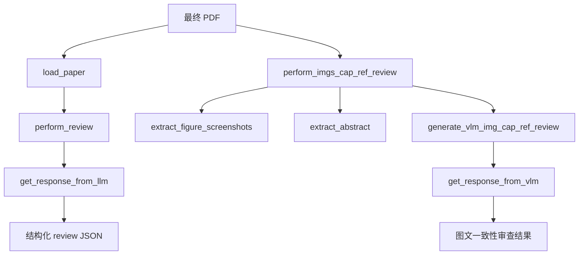
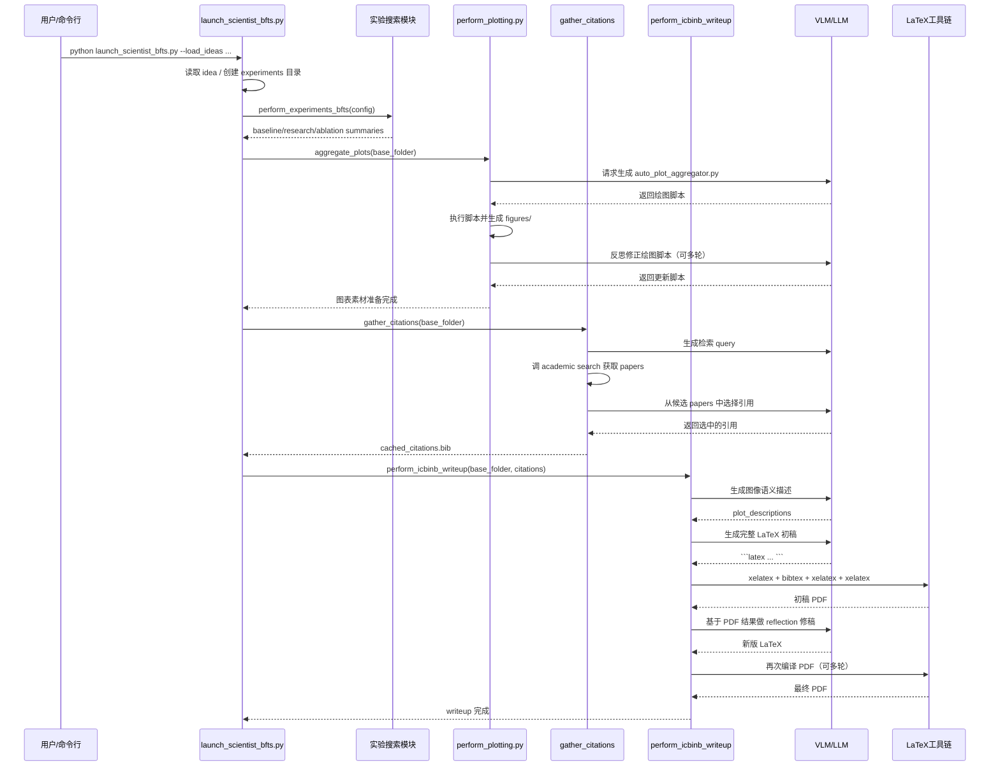
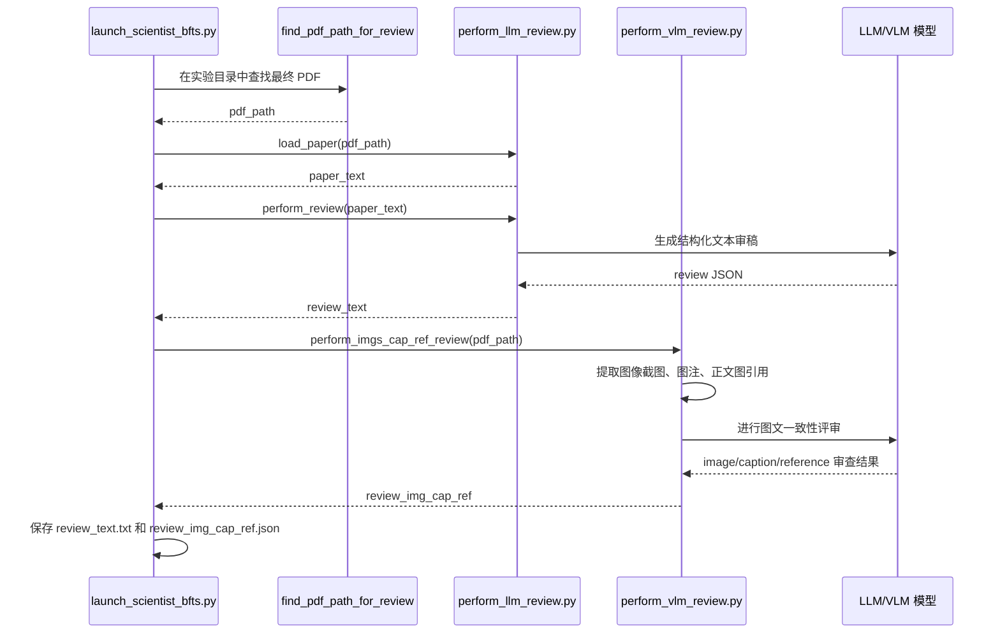

# AI-Scientist-v2 论文编写模块详细分析与二次开发指南

## 1. 文档目的

本文档用于系统拆解 `AI-Scientist-v2` 项目中“论文编写（writeup）”相关的实现逻辑，说明它如何从研究想法、实验结果、图表、引用一路生成 LaTeX 论文与 PDF，并在最后进行自动化审稿与反思修订。

文档重点覆盖三部分：

1. **论文编写主流程**：从入口脚本到最终 PDF 的完整调用链。
2. **论文编写模块实现细节**：图表聚合、引用收集、LaTeX 生成、编译、反思修稿、审稿。
3. **二次开发指南**：如果要修改论文写作逻辑、模板、提示词、审稿机制，应从哪些文件下手。

---

## 2. 项目中“论文编写”处于什么位置

从整个项目来看，论文编写不是一个孤立功能，而是研究自动化流水线的后半段。

整体流程大致如下：

```text
研究主题 Markdown / Idea JSON
    ↓
创意生成（ideation）
    ↓
实验搜索与执行（tree search / experiments）
    ↓
生成实验总结（baseline / research / ablation summaries）
    ↓
图表聚合（aggregate plots）
    ↓
引用收集（gather citations）
    ↓
论文写作（writeup）
    ↓
LaTeX 编译生成 PDF
    ↓
LLM/VLM 审稿与反思修订
```

也就是说，这个项目的 writeup 模块并不是“凭空写论文”，而是**建立在前面实验阶段已经产出的结构化总结之上**。

---

## 3. 关键入口与核心文件

如果只看论文编写链路，最重要的文件如下。

### 3.1 总入口

- `launch_scientist_bfts.py`

这是整个实验+写作+审稿的调度入口。论文编写阶段的调用顺序都在这里串起来。

### 3.2 写作核心

- `ai_scientist/perform_icbinb_writeup.py`
- `ai_scientist/perform_writeup.py`

这两个文件分别负责两种写作模式：

- `icbinb`：默认写作模式，通常面向 10 页 workshop 风格 writeup。
- `normal`：普通模式，通常面向 8 页写作流程。

当前入口默认使用 `icbinb`。

### 3.3 图表生成

- `ai_scientist/perform_plotting.py`

负责让模型基于实验总结自动写绘图脚本，执行后产出 `figures/` 中的图片，供后续论文插图使用。

### 3.4 审稿与视觉审查

- `ai_scientist/perform_llm_review.py`
- `ai_scientist/perform_vlm_review.py`

一个负责文本层面的论文审稿，一个负责 PDF 中图像、图注、图文对应关系的视觉检查。

### 3.5 提示词系统

- `prompt.yaml`
- `ai_scientist/utils/prompt_manager.py`

整个论文编写过程的“风格、结构、要求”都不是硬编码在 Python 里，而是主要由 `prompt.yaml` 驱动。

### 3.6 LaTeX 模板

- `ai_scientist/blank_icbinb_latex/`
- `ai_scientist/blank_icml_latex/`

这两个目录提供基础 LaTeX 模板。模型不是从空白开始写，而是在模板基础上重写 `template.tex`。

---

## 4. 论文编写总调用链

论文编写主链路发生在 `launch_scientist_bfts.py` 中。

其顺序可概括为：

```text
读取 ideas JSON
    ↓
创建实验目录
    ↓
执行实验搜索（perform_experiments_bfts）
    ↓
复制 experiment_results
    ↓
聚合图表（aggregate_plots）
    ↓
保存 token 使用统计
    ↓
收集 citations（gather_citations）
    ↓
执行 writeup（perform_icbinb_writeup / perform_writeup）
    ↓
找到最终 PDF
    ↓
执行文本审稿 + 图像审稿
```

可以把它理解为：

- **前半段负责产生论文素材**
- **后半段负责把素材整理成论文**

---

## 5. 入口脚本详细逻辑拆解

文件：`launch_scientist_bfts.py`

### 5.1 参数解析

入口支持这些与写作有关的参数：

- `--writeup-type`：决定使用 `normal` 还是 `icbinb` 模式。
- `--page_limit`：自定义论文页数限制。
- `--model_writeup`：写稿大模型。
- `--model_citation`：收集引用所用模型。
- `--model_agg_plots`：图表聚合使用的模型。
- `--model_review`：审稿模型。
- `--skip_writeup`：跳过写论文。
- `--skip_review`：跳过 review。

所以入口脚本本身就是整个论文流水线的调度器。

### 5.2 创建实验目录与保存 idea

流程会读取 `--load_ideas` 指定的 ideas JSON，然后：

1. 选取某个 idea。
2. 创建形如 `experiments/<timestamp>_<idea_name>_attempt_<id>` 的目录。
3. 把 idea 转成：
   - `idea.md`
   - `idea.json`

这一步很关键，因为后续写稿模块会从这个目录下再读回 idea 信息，作为论文主题和摘要来源。

### 5.3 运行实验

入口调用 `perform_experiments_bfts(...)` 执行实验。

实验完成后，重要的中间结果会进入：

- `logs/0-run/baseline_summary.json`
- `logs/0-run/research_summary.json`
- `logs/0-run/ablation_summary.json`

这些 summary 文件是 writeup 的核心数据输入，而不是原始训练日志。

### 5.4 图表聚合

入口接着调用：

- `aggregate_plots(base_folder=idea_dir, model=args.model_agg_plots)`

作用是：

1. 根据实验总结自动生成绘图脚本。
2. 执行脚本。
3. 生成统一风格的图像文件。
4. 供后续论文插图使用。

### 5.5 引用收集与 writeup

如果没有 `--skip_writeup`，入口会先执行：

- `gather_citations(...)`

再根据 `writeup_type` 调用：

- `perform_writeup(...)`
- 或 `perform_icbinb_writeup(...)`

注意：**引用收集先于写稿执行**。

### 5.6 审稿阶段

如果没跳过 review，则入口会：

1. 在输出目录中找到最终 PDF。
2. 用 `load_paper(pdf_path)` 抽取文字内容。
3. 调用 `perform_review(...)` 生成文本审稿意见。
4. 调用 `perform_imgs_cap_ref_review(...)` 生成图像/图注/引用关系审查结果。

输出通常包括：

- `review_text.txt`
- `review_img_cap_ref.json`

---

## 6. 论文写作前的素材准备机制

论文写作并不是直接从实验日志跳到 LaTeX，而是先准备两大类素材：

1. **图表素材**
2. **引用素材**

这两个步骤实际上决定了后续论文成型质量。

---

## 7. 图表聚合模块：如何为论文准备插图

文件：`ai_scientist/perform_plotting.py`

### 7.1 模块职责

这个模块的目标不是“简单画图”，而是让模型基于实验结果**自动生成一份绘图脚本**，并迭代改进，最终把论文可用图集中产出到 `figures/` 目录。

### 7.2 输入来源

模块会先读取：

- idea 文本
- experiment summaries

其中 summaries 通过 `load_exp_summaries()` 与 `filter_experiment_summaries(..., step_name="plot_aggregation")` 进行裁剪，只保留对绘图有帮助的信息，例如：

- `plot_plan`
- `plot_code`
- `plot_analyses`
- `exp_results_npy_files`
- `vlm_feedback_summary`

这意味着绘图阶段并不消费全部实验日志，而只保留与可视化强相关的上下文。

### 7.3 由 LLM 自动写绘图脚本

`aggregate_plots()` 会构造 prompt，把 idea 和精简后的实验总结交给模型，要求它输出 Python 代码。

模型输出中的 Python 代码会被提取后写入：

- `auto_plot_aggregator.py`

然后立即执行该脚本。

### 7.4 脚本执行与反思

脚本执行完成后，模块不会立刻结束，而会进入多轮 reflection：

- 检查当前生成了多少图
- 读取脚本执行 stdout/stderr
- 再次提示模型修改脚本
- 如果模型给出新代码，则重写并重新执行

因此图表模块本质上是一个小型 agent loop：

```text
总结 → 生成绘图脚本 → 执行 → 看结果 → 反思 → 再生成
```

### 7.5 对 writeup 的意义

论文写作阶段会读取：

- `figures/*.png`
- `auto_plot_aggregator.py`

前者是插图素材，后者则帮助大模型理解“这些图是怎么被构造出来的、对应哪些实验结果”。

---

## 8. 引用收集模块：如何准备 references.bib

文件：`ai_scientist/perform_icbinb_writeup.py`

核心函数：`gather_citations(...)`

### 8.1 模块职责

它的职责是自动生成 BibTeX 引用条目，并将其缓存下来，供最终 LaTeX 模板使用。

### 8.2 输入上下文

citation gathering 并不是盲搜，而是基于：

- `idea.md` / `research_idea.md`
- 裁剪后的实验总结
- 当前已有 citations

在 `filter_experiment_summaries(..., step_name="citation_gathering")` 中，会保留：

- `overall_plan`
- `analysis`
- `metric`
- `vlm_feedback_summary`

所以 citation 选择会尽量贴合这篇论文真正做了什么，而不是泛泛找相关论文。

### 8.3 citation 收集两阶段机制

citation 增量收集核心由 `get_citation_addition(...)` 完成，它采用两段式推理：

#### 第一步：决定缺什么引用

模型先看：

- 当前 paper 的实验总结
- 当前已有 citations
- 当前轮次

然后回答：

- 缺少哪类引用
- 应该用什么 query 去搜索

#### 第二步：从候选结果里挑选 paper

系统用 academic search 工具去检索，然后把候选 paper 列给模型。模型再选中最合适的一篇或几篇，并给出简短说明。

最终被选中的 paper 会提取 BibTeX，并清洗 citation key。

### 8.4 搜索工具与 fallback

检索入口是 `search_for_papers(...)`，支持：

- OpenAlex
- Semantic Scholar
- PubMed

默认优先工具由 `config.yaml` 决定，失败时会 fallback 到其他工具。

### 8.5 去重与断点续跑

citation 模块具备两个实用特性：

1. **简单去重**：通过 title 避免重复加入同一篇文献。
2. **断点恢复**：
   - `cached_citations.bib`
   - `citations_progress.json`

如果流程中断，可以从上次已完成轮次继续。

### 8.6 对 writeup 的意义

最终 citations 会在写稿前被插入 LaTeX 模板里的 `references.bib` 区块，使论文生成时就能用标准 `\cite{}` 语法引用。

---

## 9. 写作核心模块：perform_icbinb_writeup

文件：`ai_scientist/perform_icbinb_writeup.py`

这是当前项目中最完整、最重要的论文编写实现。

其主函数：

- `perform_writeup(...)`

尽管函数名叫 `perform_writeup`，但文件本身是 `icbinb` 版本。

---

## 10. 写稿主流程详细拆解

### 10.1 初始化输出文件

写稿开始时，模块会确定：

- 最终 PDF 路径
- `latex/` 目录路径

然后清理旧的：

- `latex/`
- 旧 PDF
- 旧 reflection PDF

这样可保证每轮写作是一个干净的输出环境。

### 10.2 读取 idea 与实验总结

写稿模块会调用：

- `load_idea_text(base_folder)`
- `load_exp_summaries(base_folder)`

然后通过：

- `filter_experiment_summaries(..., step_name="writeup")`

保留写作需要的关键字段：

- `overall_plan`
- `analysis`
- `metric`
- `code`
- `plot_analyses`
- `vlm_feedback_summary`

这一步非常重要，因为它体现了这个系统的一个核心设计哲学：

> **不要把所有实验细节全塞给写作模型，而是构造成简洁、结构化、可控的写作上下文。**

### 10.3 复制 LaTeX 模板

如果 `latex/template.tex` 不存在，则从：

- `ai_scientist/blank_icbinb_latex/`

复制一整套模板过去。

也就是说，模型是在一个已有 conference 风格模板基础上改写，而不是从零输出 TeX 文件。

### 10.4 扫描图像文件与聚合脚本

写稿模块会读取：

- `figures/` 中所有 `.png`
- `auto_plot_aggregator.py`

前者用于论文中的 figure，后者作为上下文帮助模型理解图像来源与图像组织方式。

### 10.5 插入 citations

如果前面已经拿到了 `citations_text`，模块会直接把 BibTeX 条目注入模板中的 `references.bib` 区块。

这样后续生成论文正文时，模型就可以显式使用 `\cite{...}`。

### 10.6 用 VLM 先理解每张图

这是这个项目比较有意思的地方。

在正式生成论文正文前，它会对每张 `figures/*.png` 做一次 VLM 级别的图像理解，生成：

- 图的内容描述
- 图表示的趋势或信息概述

然后把这些描述拼成 `plot_descriptions_str`，加入最终 writeup prompt。

因此，写稿模型不是只拿到图片文件名，而是拿到了“图的语义描述”。

这显著提升了模型写图注和正文引用图像的能力。

---

## 11. Prompt 驱动的论文生成机制

### 11.1 Prompt 并不硬编码在 Python 中

writeup 模块依赖 `prompt.yaml` 中的几个关键段落：

- `icbinb_writeup.writeup_system`
- `icbinb_writeup.data_usage_note`
- `icbinb_writeup.conclusion_guidance`
- `icbinb_writeup.writeup_prompt`

Python 只负责：

1. 读取 YAML。
2. 把变量填进去。
3. 拼成最终 system prompt 和 user prompt。

因此真正决定论文风格、结构、写法的“隐形主脑”其实是 `prompt.yaml`。

### 11.2 system prompt 负责约束论文风格

system prompt 中会要求模型：

- 论文要科学准确
- 必须如实报告结果
- 必须遵守页数限制
- 必须使用英文写作
- 不要伪造实验结果
- 不要伪造 citations
- 要注意 LaTeX 编译规范
- 需要包含方法、实验、消融、结论等标准论文结构

所以它并不是开放式写作，而是高度约束的论文生成。

### 11.3 user prompt 负责注入具体上下文

最终 writeup prompt 中会包括：

- `idea_text`
- `summaries`
- `aggregator_code`
- `plot_list`
- `latex_writeup`（当前模板内容）
- `plot_descriptions`

这说明模型被要求做的事不是“从头脑补一篇论文”，而是：

> 基于现有模板和实验总结，重写出一份完整、可编译、带图带引用的 LaTeX 论文。

---

## 12. LaTeX 生成机制

写作模型返回的结果要求包裹在：

```latex
...
```

代码块中。

模块随后通过正则提取其中的 LaTeX 内容，并直接覆盖：

- `latex/template.tex`

这意味着它采用的是：

- **整篇重写式输出**

而不是：

- section-by-section patch
- AST 级别改写
- 结构化 JSON 再渲染

这样实现简单，但也意味着每次 reflection 都可能改动整份文稿。

---

## 13. LaTeX 编译机制

编译函数是：

- `compile_latex(...)`

其实际执行顺序是：

1. `xelatex template.tex`
2. `bibtex template`
3. `xelatex template.tex`
4. `xelatex template.tex`

这是标准的 LaTeX + BibTeX 多轮编译流程，用于确保：

- 文献引用解析正确
- 交叉引用刷新正确
- PDF 最终成型

它使用 `XeLaTeX`，并明确注明是为了更好支持中文环境/ctex。

---

## 14. 写稿后的多轮反思机制

这部分是整套 writeup 系统的关键亮点。

生成初稿后，模块不会直接结束，而是进入反思-修稿循环。

### 14.1 每轮反思前先编译 PDF

每轮 reflection 之前，先把当前 LaTeX 编译成一个 PDF。

例如：

- `<base>_reflection1.pdf`
- `<base>_reflection2.pdf`
- ...

这样后续检查都是基于真实渲染后的 PDF，而不是只看源码。

### 14.2 图引用一致性检查

系统会从当前 LaTeX 里解析所有 `\includegraphics{...}`，然后与 `figures/` 目录中的真实图片对比，得到：

- `used_figs`
- `unused_figs`
- `invalid_figs`

用途：

- 防止论文里引用了不存在的图。
- 防止有很多生成出来的图却没有用到。

### 14.3 图文一致性 VLM 审查

模块会调用 `perform_imgs_cap_ref_review(...)`，对 PDF 中图像、图注、正文图引用关系做视觉检查。

这个函数会：

1. 从 PDF 中截图出 figure 区域。
2. 读取 caption。
3. 找到正文里引用该 figure 的段落。
4. 交给 VLM 评审这些内容是否一致。

因此它具备了“视觉审稿”能力，而不是仅靠文本字符串分析。

### 14.4 重复图检测

模块还会调用 `detect_duplicate_figures(...)` 检测主文与 appendix 或图像集合中是否出现重复图。

这能防止论文中重复塞同一张图，浪费页数。

### 14.5 页数限制检查

`icbinb` 版本不是简单看 PDF 总页数，而是更精细地判断：

- “References” 出现在第几页、第几行
- 正文在页数限制前用了多少行
- 是否超出限制

相关函数：

- `detect_references_position_clean(...)`
- `extract_page_line_counts(...)`
- `check_page_limit(...)`
- `get_reflection_page_info(...)`

原理是：

1. 用 `pdftotext` 逐页抽取 PDF 文字。
2. 找到 “References” 出现的位置。
3. 估算正文在限制页数前用了多少 cleaned text lines。
4. 提示模型压缩或扩展内容。

这比简单用 PDF 页码更实用，因为很多 conference 模板允许 references 不计入正文页数。

### 14.6 ChkTeX 静态检查

每轮 reflection 还会执行：

- `chktex template.tex`

用于发现常见 LaTeX 问题，例如：

- 引号或标点错误
- 语法小问题
- 某些不规范写法

其输出会一并传回给模型，作为修稿依据。

### 14.7 反思 prompt 再生成论文

所有检查结果会被组合进 reflection prompt 中，再喂给 writeup 模型，让它重新输出一版完整 LaTeX。

如果新输出与旧版本不同，就覆盖 `template.tex` 再重新编译。

这个过程会持续若干轮，直到：

- 模型说 `I am done`
- 或输出与当前版本没有差异
- 或没提取到有效 LaTeX 代码块

---

## 15. 图像选择反思与最终页数反思

`icbinb` 版本在常规 reflection 之后，还有两个额外阶段。

### 15.1 图像选择反思

它会调用 `perform_imgs_cap_ref_review_selection(...)`，生成“当前图像组合是否合理”的审查意见，再通过 `img_reflection` prompt 要求模型重新组织图像使用方式。

目标是：

- 保留最关键的图
- 减少次要图
- 提高版面利用率

### 15.2 最终页数反思

最后还有一次专门针对 page limit 的 final reflection。

这说明设计者把“收缩到合规页数”视为单独的最终收尾动作，而不是混在通用修稿环节里。

---

## 16. normal 模式与 icbinb 模式的区别

文件：`ai_scientist/perform_writeup.py`

这个版本与 `icbinb` 版本思路相似，但相对更轻量：

1. 使用 `blank_icml_latex` 模板。
2. citation 收集直接在写稿流程中进行，而不是单独先缓存再传入。
3. 页数限制逻辑更偏向通过 `Impact Statement` 来判断正文长度。
4. reflection 机制更简单，没有 `icbinb` 那么多图像选择和最终 page limit 的后处理。

可以理解为：

- `perform_writeup.py`：基础版写作流程
- `perform_icbinb_writeup.py`：加强版写作流程

当前项目主入口默认更偏向使用增强版。

---

## 17. 审稿模块：写完论文后如何自动评审

### 17.1 文本审稿

文件：`ai_scientist/perform_llm_review.py`

它的工作方式是：

1. 从 PDF 提取文本。
2. 加载 review prompt 与审稿表格模板。
3. 让 LLM 输出结构化 review JSON。
4. 可选支持 ensemble review 与 reflection。

所以它是一个“投稿后模拟审稿人”的模块。

### 17.2 视觉审稿

文件：`ai_scientist/perform_vlm_review.py`

它会：

1. 从 PDF 中抽取 figure 截图。
2. 配对图注。
3. 抽取正文里对图的引用文本。
4. 交给 VLM 审查图、图注、正文引用是否一致。

这对于自动生成论文特别重要，因为 LLM 常见问题之一就是：

- 图注写得对不上图
- 正文对图的解释和图内容不一致

该模块正是为了解决这类问题。

---

## 18. 提示词系统在 writeup 中的地位

文件：`prompt.yaml`

如果说 Python 代码定义了“流程骨架”，那么 `prompt.yaml` 定义的就是“论文长什么样”。

它涵盖：

- ideation 阶段提示词
- citation 提示词
- writeup 系统提示词
- writeup reflection 提示词
- plotting 提示词
- review 提示词
- vlm review 提示词

这意味着你如果要调整写作风格，很多时候并不需要改 Python，而是直接改 YAML 中对应段落。

例如：

- 想让论文更保守、更像 survey：改 writeup system prompt
- 想让 citation 更偏方法对比：改 citation prompts
- 想让图文审查更严格：改 vlm review prompts

---

## 19. 论文编写模块的架构总结

可以把论文编写子系统总结成下面这个架构：



这个架构的最大特点是：

- **不是单次生成，而是闭环优化**
- **不是只看文本，而是看渲染后的 PDF**
- **不是只做写作，还自动做 reviewer 角色检查**

---

## 20. 函数级调用图：关键函数如何串起来

这一节把“模块级”说明继续下钻到“函数级”，方便后续你做调试、改写或阅读时快速定位主干函数。

### 20.1 总入口函数级主链路

从入口脚本往下看，论文编写相关的关键函数调用关系如下：



这一层可以把入口理解成一个总调度器：

- `perform_experiments_bfts(...)` 负责实验阶段。
- `aggregate_plots(...)` 负责图表准备。
- `gather_citations(...)` 负责参考文献准备。
- `perform_icbinb_writeup(...)` 或 `perform_writeup(...)` 负责生成论文。
- `perform_review(...)` 与 `perform_imgs_cap_ref_review(...)` 负责最后审稿。

### 20.2 writeup 内部函数级调用图

`icbinb` 写作主链路可以进一步拆成下面这样：



这张图反映出 writeup 不是一个“线性生成器”，而是一个**带反馈回路的函数网络**：

1. 先加载 idea、summary、图片与 prompt。
2. 再生成初稿 LaTeX。
3. 编译出 PDF。
4. 基于 PDF 做图文、页数、重复图和 chktex 检查。
5. 再把这些检查结果喂回模型重写 LaTeX。

### 20.3 citation 模块函数级调用图

引用收集的内部逻辑也比较清晰：



这说明 citation 不是简单地“搜一下论文”，而是：

- 先由模型决定检索意图；
- 再由搜索工具获取候选；
- 再由模型做二次筛选；
- 最后系统负责去重与缓存。

### 20.4 plotting 模块函数级调用图

图表聚合的主函数关系如下：



这部分和 writeup 很像，也是一个：

- 先生成脚本
- 再执行脚本
- 再读取执行反馈
- 再反思修正脚本

的闭环。

### 20.5 review 模块函数级调用图

最终审稿层又可以拆成两个分支：



这里的结构也很清楚：

- 文本审稿走 `PDF -> 文本提取 -> LLM review`
- 图像审稿走 `PDF -> 图像截图/图注/正文引用抽取 -> VLM review`

所以 review 阶段也是双通道的：文本通道 + 视觉通道。

---

## 21. 时序流程图：从入口到最终 PDF 与 review

上面讲的是“函数关系网”，下面这一节换成“按时间顺序”看整个流程，更适合你理解一次完整运行时，系统到底先做什么、后做什么。

### 21.1 论文生成主时序图



这张图说明，真正耗时的地方主要集中在三段：

1. 实验搜索与执行；
2. 图表和引用素材准备；
3. writeup 后的多轮 reflection 编译。

### 21.2 最终 review 时序图



这个时序图显示，review 阶段和 writeup 阶段是松耦合的：

- writeup 只负责产出 PDF；
- review 只消费 PDF；
- 因此后续如果你要把 review 拆出去单独运行，会比较容易。

### 21.3 一次完整运行的阶段性产物时间线

为了更方便排查和理解，也可以把关键产物按时间顺序列出来：

```text
1. idea.md / idea.json
2. logs/0-run/baseline_summary.json
3. logs/0-run/research_summary.json
4. logs/0-run/ablation_summary.json
5. auto_plot_aggregator.py
6. figures/*.png
7. cached_citations.bib
8. latex/template.tex
9. *_reflection*.pdf
10. 最终 PDF
11. review_text.txt
12. review_img_cap_ref.json
```

如果你在调试时发现流程中断，最有效的办法通常就是顺着这个时间线检查：

- 是素材没产出？
- 是 LaTeX 没写出来？
- 是编译失败？
- 还是 review 阶段出错？

---

## 22. 设计优点分析

### 20.1 结构化 summary 驱动，减少上下文噪音

写作不直接读取原始训练日志，而是读取精选 summary，能有效减少 prompt 污染与上下文冗余。

### 20.2 图、文、引用分阶段处理

把图片生成、引用收集、论文生成分开，让每一阶段都有单独优化空间。

### 20.3 基于真实 PDF 的反思闭环

不是仅检查源码，而是把 LaTeX 编译为 PDF 后再做版面、图文、页数检查，这很符合真实论文写作场景。

### 20.4 Prompt 与代码解耦

大量行为由 `prompt.yaml` 控制，便于快速调整风格与策略。

### 20.5 支持多模态质量控制

借助 VLM 审查 figure/caption/reference 一致性，是单纯文本 pipeline 很难做到的。

---

## 21. 设计局限与潜在问题

### 21.1 全文重写式 LaTeX 输出不够稳

每轮 reflection 都可能改整篇论文，容易出现局部修正带来全局退化的问题。

### 21.2 citation 去重较简单

当前主要按 title 做简单去重，对变体标题、大小写、轻微差异不一定稳健。

### 21.3 图表脚本由 LLM 直接生成并执行

灵活，但也意味着安全性与稳定性取决于运行环境控制。

### 21.4 页数判断依赖文本抽取启发式

`References` 检测和 cleaned lines 统计是实用方案，但不是排版级精确计算。

### 21.5 normal 与 icbinb 两套逻辑存在重复

两个 writeup 文件有不少共性逻辑，可进一步抽象，但当前项目更偏快速实验而非高度工程化复用。

---

## 22. 二次开发指南：如果你要修改论文编写模块

下面按常见需求给出改动入口。

---

## 23. 场景一：想修改论文结构或写作风格

### 改哪里

优先改：

- `prompt.yaml`

重点关注：

- `writeup.system_template`
- `writeup.writeup_prompt`
- `icbinb_writeup.writeup_system`
- `icbinb_writeup.writeup_prompt`
- `...reflection` 相关 prompt

### 适合改的内容

- 章节结构
- 方法部分要求
- 实验章节要求
- 结论语气
- 是否强调失败结果也要诚实汇报
- 对 synthetic data 的表述方式

### 不一定要动 Python

大多数论文风格调整，不需要先改代码，优先改 prompt 就够了。

---

## 24. 场景二：想换论文模板或投稿 venue

### 改哪里

- `ai_scientist/blank_icbinb_latex/`
- `ai_scientist/blank_icml_latex/`
- 以及 writeup 中复制模板的那段逻辑

### 建议做法

1. 新建一个模板目录，例如：
   - `ai_scientist/blank_neurips_latex/`
2. 在入口参数中增加新的 `writeup-type`。
3. 让对应 writeup 函数复制新的模板目录。
4. 调整 prompt 中关于页数、格式、appendix 的要求。

### 注意事项

如果模板风格变化较大，页数检查逻辑可能也要跟着调，尤其是：

- References 检测方式
- Impact Statement 检测方式
- appendix 边界定义

---

## 25. 场景三：想增强引用质量

### 改哪里

- `ai_scientist/perform_icbinb_writeup.py`
- `prompt.yaml` 中 citation 相关 prompt
- `ai_scientist/tools/open_alex.py`
- `ai_scientist/tools/semantic_scholar.py`
- `ai_scientist/tools/pubmed.py`

### 可以怎么增强

- title 去重改为 DOI / title normalization / embedding 相似度
- 增加按年份、venue、引用数筛选
- 对 Related Work / Method / Experiment 分章节收集 citation
- 对已选 paper 建立引用主题标签

### 推荐改法

先改 citation prompt，再考虑升级搜索排序逻辑。因为大多数 citation 质量问题通常先出在“检索意图不清”，不一定是搜索 API 本身不够用。

---

## 26. 场景四：想增强图表与图注质量

### 改哪里

- `ai_scientist/perform_plotting.py`
- `ai_scientist/perform_vlm_review.py`
- `prompt.yaml` 中 `plot_aggregation.*` 与 `vlm_review.*`

### 可以怎么增强

- 强化图表统一视觉风格要求
- 加强图标题、坐标轴、图例规范
- 在 VLM review 中增加“是否信息过载”“是否难以阅读”的检查
- 在 reflection 中加入“图过大/过小/不平衡”的反馈

### 推荐思路

图表质量主要受两部分影响：

1. 聚合脚本本身画得好不好
2. 论文里对图的组织和选择是否合理

所以通常要同时改 plotting prompt 和 writeup reflection prompt。

---

## 27. 场景五：想让写稿更稳定，减少全文反复改坏

### 改哪里

- `ai_scientist/perform_icbinb_writeup.py`
- `ai_scientist/perform_writeup.py`

### 当前问题

现在每轮 reflection 都要求模型输出完整 LaTeX，这会带来：

- 小修变大改
- 已经正确的部分被改坏
- 版本漂移

### 可选优化方向

1. **分 section 反思**：只重写某个章节。
2. **结构化 patch**：让模型输出 patch 或替换段落。
3. **冻结已稳定部分**：例如参考文献、标题、摘要在后期不再允许大改。
4. **增加 diff 判断**：如果修改范围过大则拒绝采用。

这是后续工程化升级最值得投入的一点。

---

## 28. 场景六：想扩展审稿能力

### 改哪里

- `ai_scientist/perform_llm_review.py`
- `ai_scientist/perform_vlm_review.py`
- `prompt.yaml` 中 `review.*` 与 `vlm_review.*`

### 可以怎么增强

- 增加 reviewer ensemble 数量
- 引入不同 reviewer persona
- 区分“方法创新性审稿”“实验严谨性审稿”“写作表达审稿”
- 增加 rebuttal 草稿生成
- 增加接受概率预测或弱项分类

如果目标是把系统做成“自动投稿代理”的更完整闭环，review 模块会是重点扩展方向。

---

## 29. 场景七：想快速定位论文编写 bug

推荐先按这个顺序排查：

### 1）先看入口目录输出是否完整

检查实验目录中是否存在：

- `idea.md`
- `logs/0-run/*.json`
- `figures/`
- `auto_plot_aggregator.py`
- `cached_citations.bib`
- `latex/template.tex`
- 最终 PDF

### 2）再看 writeup 前的素材是否已经坏掉

常见问题：

- summary 空或结构不对
- figures 没生成
- citations 为空
- aggregator script 执行失败

### 3）再看 LaTeX 初稿能否提取成功

重点看模型是否正确返回：

```latex
...
```

代码块。

### 4）再看编译错误

重点关注：

- `xelatex` 输出
- `bibtex` 输出
- `chktex` 输出

### 5）最后看 reflection 是否越修越坏

如果每轮改动都很大，通常要考虑：

- 缩短 reflection prompt
- 减少允许修改范围
- 减少反思轮数

---

## 30. 推荐阅读顺序

如果你要彻底理解这套论文系统，建议按下面顺序读代码。

### 第一层：先看总流程

1. `README.md`
2. `launch_scientist_bfts.py`

### 第二层：再看写稿主逻辑

3. `ai_scientist/perform_icbinb_writeup.py`
4. `ai_scientist/perform_writeup.py`

### 第三层：看写稿依赖模块

5. `ai_scientist/perform_plotting.py`
6. `ai_scientist/perform_llm_review.py`
7. `ai_scientist/perform_vlm_review.py`

### 第四层：看 prompt 与模板

8. `prompt.yaml`
9. `ai_scientist/blank_icbinb_latex/`
10. `ai_scientist/blank_icml_latex/`

---

## 31. 最终总结

`AI-Scientist-v2` 的论文编写系统，本质上不是一个简单的“LLM 写论文脚本”，而是一条完整的自动科研后处理流水线。

它的真实工作模式是：

1. **实验阶段先产出结构化 research summaries**。
2. **图表模块自动生成图像素材**。
3. **citation 模块自动补充 BibTeX 引用**。
4. **writeup 模块把 idea、summary、图像描述、引用、LaTeX 模板一起交给模型，生成完整论文**。
5. **编译后再通过 chktex、页数检测、VLM 图文审查进行反思修订**。
6. **最后再用 LLM/VLM 扮演 reviewer 自动审稿**。

因此它的核心能力不只是“写”，而是：

- **写前准备素材**
- **写中遵守模板与结构约束**
- **写后基于 PDF 做真实反思修订**
- **最终再执行类似同行评审的质量检查**

从工程角度看，这套系统最大的亮点在于它把“论文写作”拆成了多个可控阶段，并通过 prompt + LaTeX + PDF + VLM 的组合形成闭环。

如果你后续想继续深入，我建议优先从 `perform_icbinb_writeup.py` 和 `prompt.yaml` 下手，因为这两者几乎决定了系统的论文生成质量与风格上限。
